# 반응형 웹사이트(RWD)

## 반응형 웹사이트란?

반응형 웹사이트란 다양한 디스플레이 환경을 지원하기 위해서 만들어진 웹 페이지 형태입니다. 사용자의 행동이나, 환경의 변화에 따라 자동으로 반응하여 요소들이 적절하게 배치되도록 만들게 됩니다. 하지만 반응형 웹사이트는 완전히 기존과 분리된 기술이 아닙니다. 같은 HTML 마크업을 사용하고, 뷰포트에 따른 CSS 요소에 변화를 줌으로써 반응형을 구현해내게 됩니다.

## 반응형 웹의 탄생 배경

과거의 웹사이트는 대부분 데스크톱에서만 사용할 수 있었고, 모바일 피쳐폰이 등장하면서 회사들은 모바일 웹에 관심을 가지게 됩니다. 하지만 지나치게 비싼 통신사 요금으로 인해 초기에는 개발이 실제로 잘 되지는 않았습니다. 스마트폰, 태블릿 PC의 발전으로 인해 모바일 웹 사용의 수요가 기하급수적으로 늘어났고, 회사들은 이 수요에 맞추기 위해, 장비의 화면 크기에 맞는 여러 버전의 웹페이지를 만들어내게 되었습니다. 그리고 이는 유지보수에 대한 엄청난 부담감을 가지고 오게 되었습니다. 또한 장비마다 다른 URL 을 지원해야 되기 때문에, SEO에도 불리한 측면이 있었습니다. 이런 요인들로 인해 반응형 웹이 나오게 되었습니다.

## 반응형 웹의 장점

### 간편한 유지보수

여러가지 버전의 웹을 따로 만들게 되면 유지보수를 모두 따로 해주어야 합니다. 반응형 웹사이트는 html 파일과 css 파일을 하나로 관리할 수 있기 때문에, 유지보수에 유리합니다.

### 다양한 장비 지원

고정형 웹은 데스크톱 밖에 지원하지 못하지만, 지금은 다양한 모바일 장비를 지원해야 합니다. 이런 내용을 최적화시켜 지원할 수 있습니다.

### 검색엔진 최적화

모바일 버전과 데스크톱 버전 두 개의 사이트를 가지고 있으면 url 이 다르기 때문에, 버전이 많으면 많을 수록 검색엔진은 중복되는 자료들 때문에 스팸으로 인식할수도 있고, 정확한 정보를 확인할 수 없어지게 됩니다. 하지만 반응형으로 웹사이트를 구축한다면, 하나의 url 로 관리되기 때문에, 상대적으로 SEO에 유리하게 됩니다.

## 반응형 웹에서의 접근성

데스크톱 웹에서와 마찬가지로 접근성에 대한 고민을 해야할 필요가 있습니다. 특히 모바일의 경우 다른 차원의 접근성 문제가 발생할 수 있기 때문에, 다른 기준의 접근성을 정의할 필요가 있습니다. 한국웹접근성인증평가원은 모바일 애플리케이션에서 지켜야 할 접근성에 대해 18개의 기준을 제시합니다.

| 구분                       | 반드시 준수해야 할 사항(18개)                                                                                          |
| -------------------------- | ---------------------------------------------------------------------------------------------------------------------- |
| 대체 텍스트                | 텍스트 아닌 콘텐츠는 대체 가능한 텍스트와 함께 제공되어야 한다.                                                        |
| 자막, 수화 등의 제공       | 영상이나 음성 콘텐츠에는 동등한 내용의 자막, 원고 또는 수화가 제공되어야 한다.                                         |
| 색에 무관한 인식           | 화면에 표시되는 모든 정보는 색에 관계없이 인식될 수 있어야 한다.                                                       |
| 명도대비                   | 화면에 표시되는 모든 사용자 인터페이스 컴포넌트와 텍스트는 전경색과 배경색이 구분될 수 있도록 제공되어야 한다.         |
| 명확한 지시사항            | 지시 사항은 모양, 크기, 위치, 방향, 색, 소리 등에 관계없이 인식될 수 있어야 한다.                                      |
| 알림 기능                  | **알림 정보는 화면 표시, 소리, 진동 등 다양한 방법으로 제공되어야 한다.**                                              |
| 초점                       | 의미나 기능을 갖는 모든 사용자 인터페이스 컴포넌트에는 초점(focus)이 적용되고, 초점은 논리적인 순서로 이동되어야 한다. |
| 누르기 동작 지원           | **터치(touch) 기반 모바일 기기의 모든 컨트롤은 누르기 동작으로 제어할 수 있어야 한다.**                                |
| 응답시간 조절              | 시간 제한이 있는 콘텐츠는 응답 시간을 조절할 수 있어야 한다.                                                           |
| 정지 기능 제공             | 자동으로 변경되는 콘텐츠는 움직임을 제어할 수 있어야 한다.                                                             |
| 컨트롤의 크기와 간격       | 컨트롤은 충분한 크기와 간격으로 제공되어야 한다.                                                                       |
| 입력도움                   | 입력 서식 이용 시, 입력 오류를 방지하거나 정정할 수 있는 방법을 제공해야 한다.                                         |
| 사용자 인터페이스의 일관성 | 사용자 인터페이스 컴포넌트들은 일관성 있게 배치되어야 한다.                                                            |
| 깜박거림의 사용 제한       | 깜빡이거나 번쩍이는 콘텐츠를 제공하지 않아야 한다.                                                                     |
| 자동재생 금지              | 자동으로 재생되는 배경음을 사용하지 않아야 한다.                                                                       |
| 예측가능성                 | 사용자가 의도하지 않는 화면 전환이나 이벤트 등이 실행되는 경우 사용자가 이해할 수 있는 방법으로 제공되어야 한다.       |
| 범용 폰트 이용             | 텍스트 콘텐츠는 운영체제에서 제공하는 폰트 관련 기능을 활용할 수 있는 방법을 제공해야 한다.                            |
| 보조기술과의 보완성        | 사용자 인터페이스 컴포넌트는 보조 기술을 이용하여 사용할 수 있도록 해야 한다.                                          |

접근성의 경우 모바일 웹과 고정형 웹이 크게 다르지는 않습니다다. 왜냐하면 같은 마크업을 기준으로 스타일링을 다르게 하는 것이기 때문입니다.
하지만 모바일이라는 특성에 맞는 접근성을 추가로 고려해주어야 하는데, 푸쉬 알람이나, 터치 같은 데스크톱과 다르게 작동하는 부분들을 추가로 신경 써주어야 합니다.

### 모바일 접근성을 잘 준수한 사례

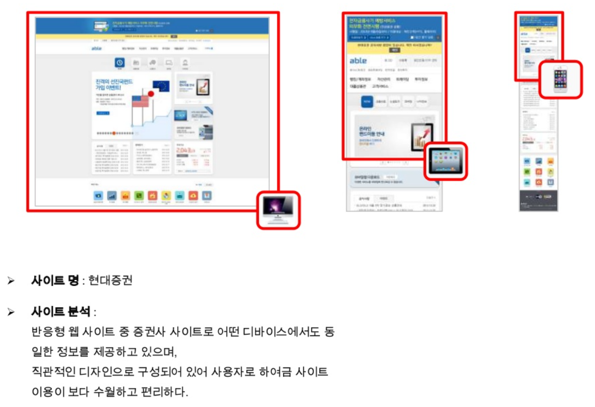
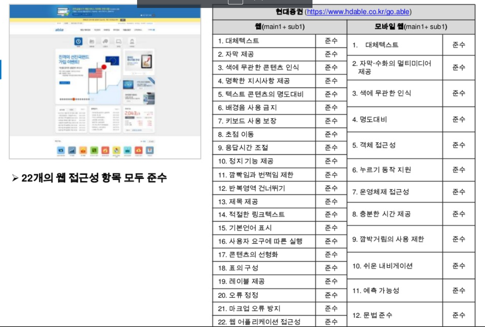
위 예시는 현대증권에 대한 예시로 시간은 많이 지났지만, 모바일 구성을 잘한 예시라 생각되어 인용했습니다. 먼저 태블릿 환경까지 신경써서 3개의 화면을 적절한 구성으로 배치했으며 누락된 정보가 없습니다. 또한 접근성에 대해서도 지침을 잘 준수하여, 차별 없이 웹을 사용할 수 있게 만들었습니다.

## 2. 고정형 웹사이트와의 차이

### 미디어 쿼리

#### 미디어 쿼리란?

미디어 쿼리는 CSS3에서 소개된 CSS 기법입니다.
`@media`를 통해 선언할 수 있으며 지정해 놓은 특정 조건을 만족할때 해당 CSS속성을 적용시킵니다.

반응형 웹이 탄생할 수 있었던 배경에는 미디어 쿼리의 영향이 가장 지배적이었는데 2012년 미디어 쿼리 레벨 3의 W3C Recommendation이 이루어지며 웹에 활발하게 사용되기 시작했습니다.
미디어 쿼리를 사용하면 여러가지 환경을 파악하여 사용자 환경에 알맞는 CSS를 선택적으로 적용시켜 줄 수 있습니다.

일반적으로 어떤 종류의 미디어인지와 화면 크기를 비교해 반응형 웹을 구현하는데 이 밖에도 해상도, 비트 수, 가로 / 세로 여부 등 다양하고 세밀한 부분까지 탐지하여 적용을 할 수 있습니다.

#### 미디어 쿼리의 목적

미디어 쿼리를 사용하는 주 목적은 각 유형의 장치에 적절한 사용자 경험을 만드는 것입니다. 미디어 쿼리를 사용하면 각 장치의 고유한 속성을 기반으로 클라이언트 브라우저에 응답 할 수 있게 만들어 줍니다. 웹 페이지가 로드되서 브라우저에 표시되기 전 미디어 쿼리를 통해 적용된 CSS가 반영이 됩니다.

CSS 미디어 쿼리의 가장 큰 장점은 각 개별 장치에 대해 모든 해상도와 화면 크기를 지정할 필요가 없다는 것입니다.
따라서 미디어 쿼리를 이용해 웹 페이지를 제작하면 여러 유형의 기기에서 보여지는 디자인을 최적화하기 쉽고 용이합니다.

#### 미디어 쿼리와 접근성

미디어 쿼리를 이용하면 특정 장애가 있는 사용자 및 일반 사용자들의 접근성 또한 개선할 수 있습니다.

예를 들면 광과민성 증후군 및 주의력결핍 장애가 있는 사용자들에게 깜빡이거나 반짝이는 애니메이션은 발작 유발 및 웹 페이지의 이해를 어렵게 만들수 있습니다.
이를 미디어 쿼리를 이용한 애니메이션 동작 축소하기 (Reduced Motion)기법으로 개선할 수 있습니다.

또한 이 기법을 이용하면 배터리가 부족한 사용자 혹은 보급형 스마트폰 및 컴퓨터를 사용하는 사용자들의 접근성도 개선할 수 있습니다.

추가적으로 표준 기법은 아니지만 고대비 모드 (High Contrast Mode)기법을 이용하면 시스템과 애플리케이션에서 고대비 모드가 표시될시 다른 색상으로 스타일링이 되도록 설정해줄 수 있습니다.

이 기법을 이용하면 저시력자 및 고대비에 민감한 사용자들의 접근성을 개선할 수 있으며 일반 사용자들이 웹 페이지를 이용할때도 가시성 및 가독성 측면에서 사용성을 개선 받을 수 있습니다.

#### 미디어 쿼리 논리 연산자

미디어 쿼리에서는 `not` `and` `only` `,(쉼표)`등의 논리 연산자들을 활용해서 복잡한 쿼리문을 조합할 수 있습니다.
이를 통해 여러 미디어 쿼리문을 하나의 규칙으로 만들 수 있습니다.

**`and`**
`and` 연산자는 다수의 미디어 특성을 조합하여 하나의 미디어 쿼리를 만들 때 사용할 수 있습니다.
연산자가 사용된 쿼리가 동작하려면 모든 구성 요소의 연산이 참이어야 합니다.
미디어 특성과 미디어 유형을 조합할때도 사용할 수 있습니다.

**`not`**
`not` 연산자는 `and` 연산자가 사용된 쿼리가 거짓일 때 참을 반환합니다.
`and` 연산자와 다르게 쉼표로 구분한 쿼리 목록 중 하나에 적용하게 되면 해당하는 쿼리에만 적용이 됩니다.
해당 연산자를 사용할 경우 반드시 미디어 유형도 함께 지정해서 사용해야 합니다.

**`only`**
`only` 연산자는 전체 쿼리문이 일치할 때만 동작하게 설정할 수 있어 오래된 브라우저가 스타일을 잘못 적용하지 못하도록 방지할때 유용하게 사용할 수 있습니다. `not` 연산자와 마찬가지로 반드시 미디어 유형도 함께 지정해서 사용해야 합니다.

**`,(쉼표)`**
`쉼표` 연산자는 다수의 미디어 쿼리문을 하나의 규칙으로 조합하여 사용할때 유용하게 사용됩니다. `and` 연산자와 다르게 쿼리문의 구성 요소 중 하나의 쿼리만 참일 경우에도 동작합니다.

**미디어 쿼리 유형**

|   유형   |                           설명                           |
| :------: | :------------------------------------------------------: |
|  `all`   |             모든 기기가 적용되는 유형입니다.             |
| `print`  | 인쇄 결과물 및 출력 미리보기 화면에 표시되는 유형입니다. |
| `screen` |         컴퓨터 / 스마트 기기의 화면 유형입니다.          |
| `speech` |                  음성 장치 유형입니다.                   |

**미디어 쿼리 기능**

|              기능              |                                        설명                                         |
| :----------------------------: | :---------------------------------------------------------------------------------: |
|          `any-hover`           |          어떠한 입력 방식을 통하여 요소 위를 hover할 수 있는지 확인합니다.          |
|         `any-pointer`          |   어떠한 입력 방식이 포인팅 방식으로 동작하는지와 그 정확도에 대해서 확인합니다.    |
|         `aspect-ratio`         |                      뷰 포트의 가로 / 세로 비율을 확인합니다.                       |
|            `color`             |          출력 장치의 색상 별 비트 수를 확인하며 흑백일 땐 0을 나타냅니다.           |
|         `color-gamut`          |          사용자의 출력 장치가 지원하는 색상의 대략적인 범위를 확인합니다.           |
|         `color-index`          |        출력 장치의 색상 항목 수를 확인하며 존재하지 않을 땐 0을 나타냅니다.         |
|        `forced-colors`         |               사용자 에이전트가 색상 팔레트를 제한하는지 확인합니다.                |
|             `grid`             |          기기가 그리드와 비트맵 스크린 중 어떤 것을 사용하는지 확인합니다.          |
|            `height`            |                            뷰 포트의 높이를 확인합니다.                             |
|            `hover`             |          주 입력 방식으로 사용자가 요소 위를 hover할 수 있는지 확인합니다.          |
|       `inverted-colors`        |           사용자 에이전트 혹은 운영 체제가 색상을 반전 중인지 확인합니다.           |
|         `light-level`          |                           주변 환경의 광도를 확인합니다.                            |
|          `monochrome`          |     모노크롬 프레임 버퍼의 비트 수를 확인하며 모노크롬이 아니면 0을 나타냅니다.     |
|         `orientation`          |                            뷰 포트의 방향을 확인합니다.                             |
|        `overflow-block`        | 블록 축 방향으로 뷰 포트를 오버플로우 할 시 출력 장치가 어떻게 처리될지 확인합니다. |
|       `overflow-inline`        |     인라인 축 방향으로 뷰 포트를 오버플로우 할 시 스크롤이 가능한지 확인합니다.     |
|       `inverted-colors`        |           사용자 에이전트 혹은 운영 체제가 색상을 반전 중인지 확인합니다.           |
|           `pointer`            |     주 입력 방식이 포인팅 방식으로 동작하는지와 그 정확도에 대해서 확인합니다.      |
|     `prefers-color-scheme`     |              라이트/다크 모드 중 사용자가 선호하는 모드를 확인합니다.               |
|       `prefers-contrast`       |            사용자가 두 인접 색상의 고 대비 색상을 요청했는지 탐지합니다.            |
|    `prefers-reduced-motion`    |                   사용자가 줄어든 움직임을 선호하는지 확인합니다.                   |
| `prefers-reduced-transparency` |               사용자가 투명도가 감소된 부분을 선호하는지 확인합니다.                |
|          `resolution`          |                        출력 장치의 해상도 밀도를 확인합니다.                        |
|             `scan`             |                         출력 장치의 스캔 절차를 확인합니다.                         |
|          `scripting`           |            자바 스크립트를 비롯한 스크립트 사용 가능 여부를 탐지합니다.             |
|            `update`            |            출력 장치가 콘텐츠의 외관을 수정할 수 있는 주기를 확인합니다.            |
|            `width`             |                    스크롤바를 포함한 뷰포트의 너비를 확인합니다.                    |

**예시**

연산자를 활용하여 미디어 쿼리를 적용한 예시입니다.

해당 예시를 보면 screen유형의 기기에 최소 너비가 800 픽셀 이상이 되는 기기에만 해당 css를 적용한다는 것을 명시해 줍니다.

```css
@media screen and (min-width: 800px) {
  .container {
    margin: 1em 2em;
  }
}
```

미디어 쿼리를 이용해서 설정한 기기의 특정 요소의 display를 none으로 변경해준 예시입니다.

아래의 예시에서는 screen유형의 기기에 너비가 600 픽셀 이하라면 display를 none으로 처리해주고 있습니다.

```css
@media screen and (max-width: 600px) {
  div.example {
    display: none;
  }
}
```

미디어 쿼리를 이용해 애니메이션을 축소해서 접근성 개선한 예시입니다.

아래의 예시처럼 코드를 작성하게 되면 사용자가 기기에서 애니메이션 축소와 관련된 기능을 설정하였을 경우 아래의 미디어 쿼리 스타일링이 적용되어 어떠한 애니메이션도 보여지지 않게 됩니다.

```html
<div class="animation">animated box</div>
```

```css
.animation {
  -webkit-animation: vibrate 0.3s linear infinite both;
  animation: vibrate 0.3s linear infinite both;
}

@media (prefers-reduced-motion: reduce) {
  .animation {
    animation: none;
  }
}
```

미디어 쿼리를 이용해 고대비 모드의 화면의 색상을 다른 스타일링으로 변경한 예시입니다.

아래의 예시처럼 코드를 작성하게 되면 색상과 관계없이 고대비 모드로 화면이 표기되는 상황에 설정해놓은 스타일링을 적용시키게 됩니다.

```css
@media screen and (-ms-high-contrast: active) {
  /* 모든 고대비 모드에 대한 스타일 규칙입니다 */
}
@media screen and (-ms-high-contrast: black-on-white) {
  div {
    background-image: url("image-bw.png");
  }
}
@media screen and (-ms-high-contrast: white-on-black) {
  div {
    background-image: url("image-wb.png");
  }
}
```

애플 홈페이지에서 사용된 Media Query의 예시입니다.

| 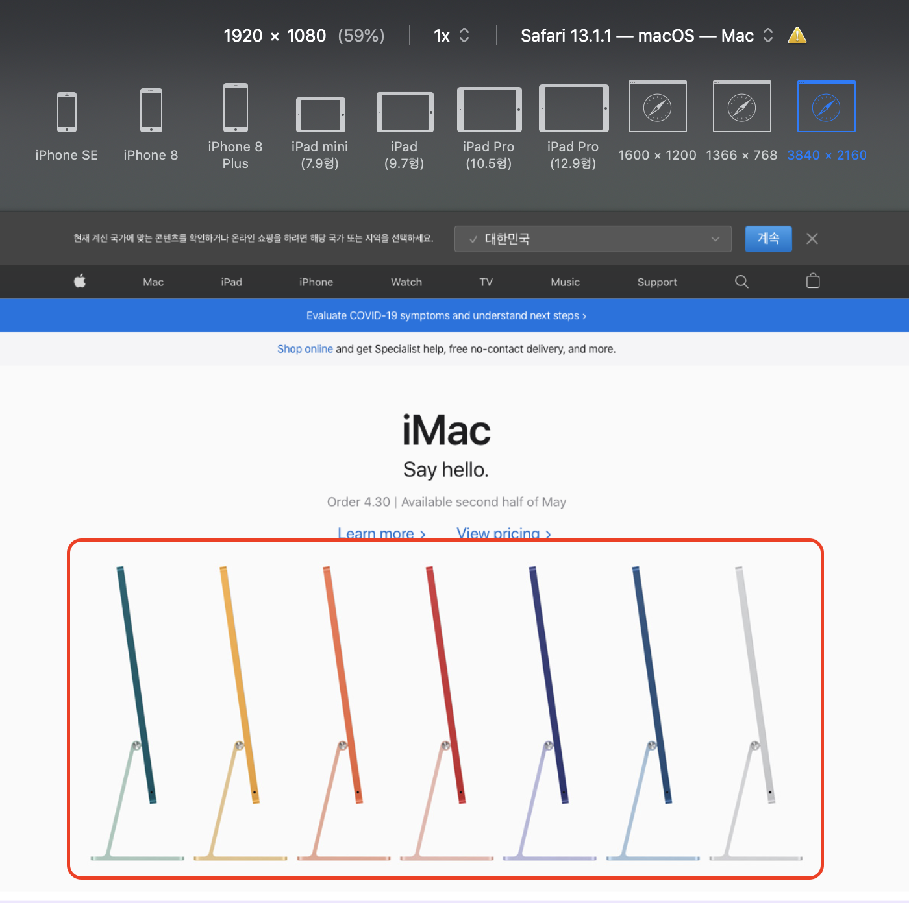 |
| :-----------------------------------------: |
|           애플 맥북 환경 홈페이지           |

| 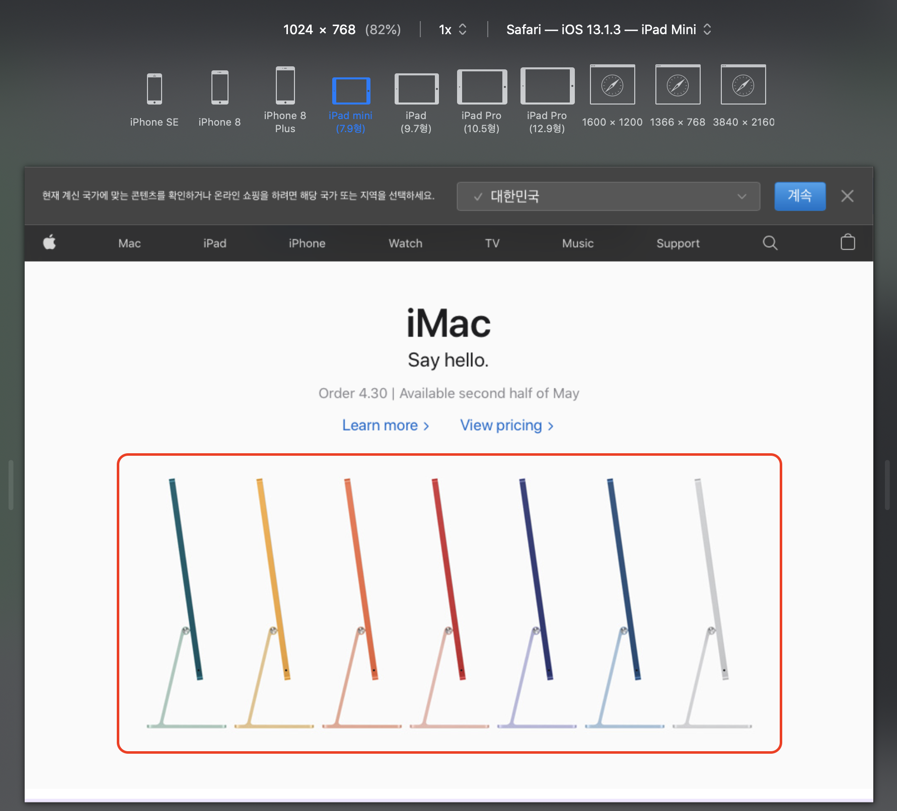 |
| :-----------------------------------------: |
|      애플 아이패드 미니 환경 홈페이지       |

| 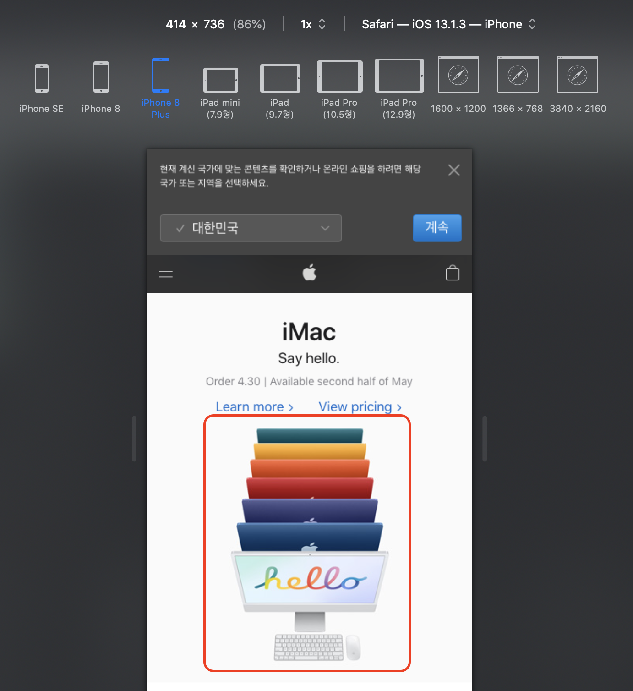 |
| :-----------------------------------------: |
|          애플 아이폰 환경 홈페이지          |

| 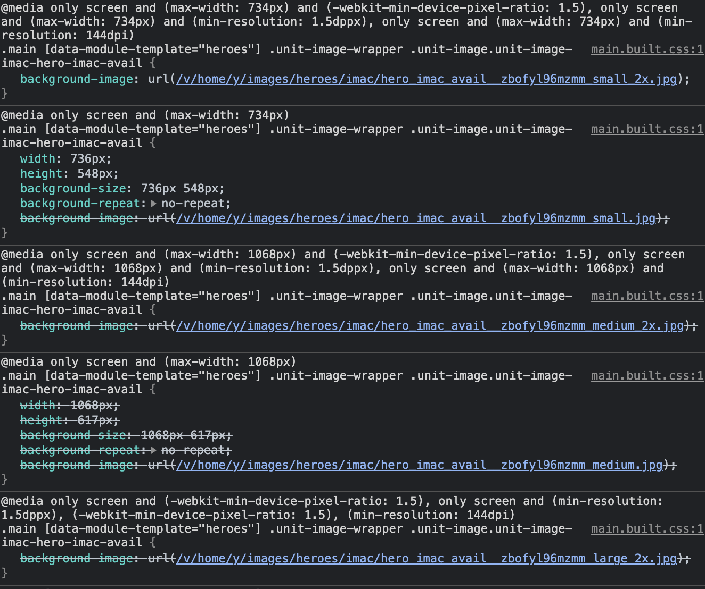 |
| :----------------------------------------: |
|        해당 페이지 media query css         |

위에 사진들을 보면 각 기기의 환경에 따라 실질적으로 사용자에게 보여지는 화면의 모습에 차이가 있음을 알 수 있습니다.

해상도와 너비 값을 맥북과 아이패드에 맞게 설정해두면 이번에 새롭게 출시된 아이맥의 7가지 컬러가 옆으로 정렬되어 보여지는 모습을 볼 수 있으며 아이폰으로 설정 값을 변경 시 앞 뒤로 정렬이 되어 있는 아이맥의 모습을 볼 수 있습니다.

**호환성**

| 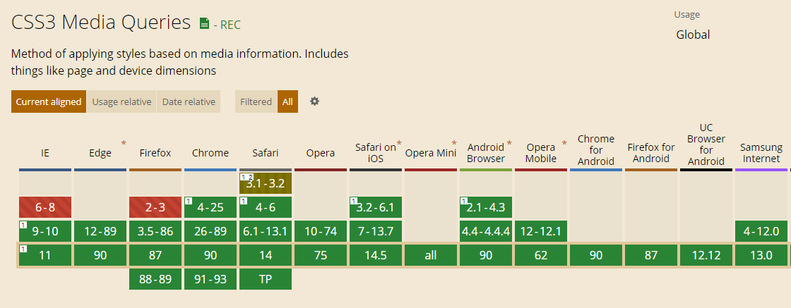 |
| :----------------------------------------: |
|           Can I use 호환성 결과            |

미디어 쿼리의 호환성 검사 결과입니다.

낮은 버젼의 Internet Explore와 Firefox를 제외하고는 모든 브라우저에서 정상적으로 호환이 되고 있는 모습입니다.

| 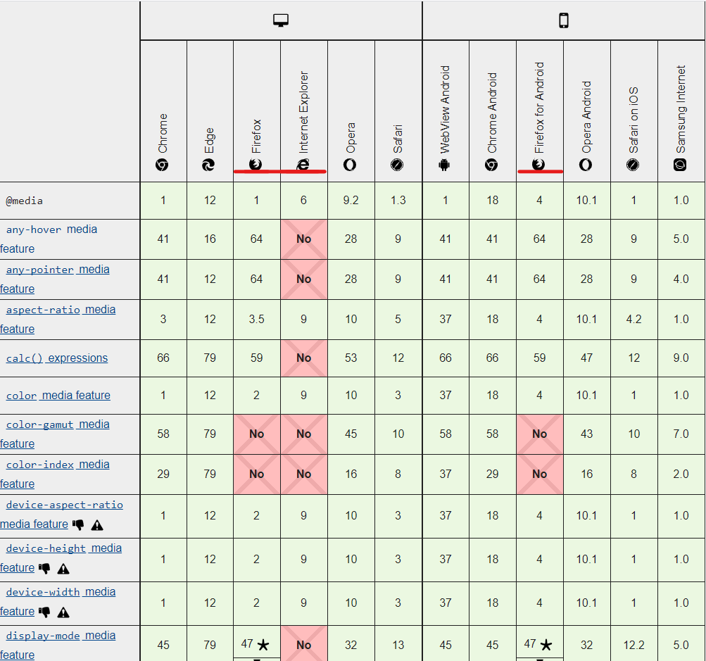 |
| :----------------------------------------: |
|    MDN 미디어 쿼리 특성들의 호환성 결과    |

대부분의 브라우저에서 호환성이 좋은 것으로 확인되나 Internet Explore에서는 좋지 않은 호환성을 지니고 있습니다. 또한 Firefox 브라우저에서도 약간의 호환성 문제가 있는 것으로 보여지지만 자주 사용되는 특성들에 대해서는 대부분 호환이 가능한 모습입니다.

### 반응형 단위

#### vw(Viewport Width)

뷰포트를 기준으로 한 단위이며 '1vw = 뷰포트 너비의 1% 입니다.

#### vh(Viewport Height)

vw와 마찬가지로 뷰포트 높이의 1%를 칭합니다.

##### vw와 vh 활용법

이들 단위는 뷰포트 영역 전체를 차지하게 하거나, 그 일부분만 차지하게 하는 데 유용하게 쓸 수 있습니다. 따라서 사용자 브라우저 창 크기를 바꾸거나 모바일 화면을 회전시켜도 유연하게 대처할 수 있습니다.

이 단위들은 `calc()`와 결합하면 좋은 시너지를 낼 수 있습니다. 헤더 영역 높이가 50px이고 콘텐츠 영역 높이를 '헤더를 제외한 나머지 높이 전체'로 만들고 싶다면, `height: calc(100vh - 50px)`을 지정해주면 됩니다.

`height: 100%`로 지정해도 100vh처럼 전체 높이를 차지할 수 있지만, `%`의 경우 부모 요소를 기준으로 계산하기 때문에 이 경우 부모 요소에도 `height: 100%`을 추가하여야 합니다.

#### vmin

vmin은 vw와 vh중 더 작은 것을 적용합니다.

#### vmax

vw와 vh 중 더 큰 것을 적용합니다.

##### vmin과 vmax 활용법

이 둘을 적절히 활용하면 '언제든 화면에 보이는 요소'와 '언제든 화면을 꽉 채우는 요소'를 만들 수 있습니다.

예를 들어 뷰포트가 1000px \* 1000px일 때, 80vw를 길이로 가지는 정사각형 요소가 있다고 가정합니다. 만약 여기서 높이가 줄어들면(휴대폰 가로모드) vw는 변하지 않아 요소가 잘려서 보입니다. 만약 이를 80vmin으로 고친다면 너비/높이 값 중 무엇이 바뀌던 상관없이 정사각형 요소를 나타낼 수 있습니다.

**호환성**
|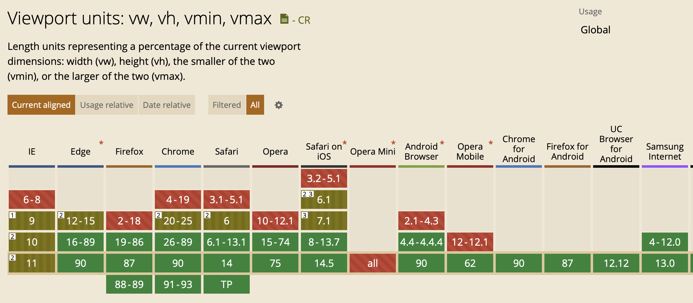|
|:--:|
|vw, vh, vmin, vmax 호환성|

#### em

`em`은 폰트 크기의 영향을 받습니다. 1em은 부모의 폰트 크기입니다. 만약 부모의 폰트 크기가 16px이라면, 1em = 16px이 되고 2em = 32px이 됩니다.

**호환성**

| 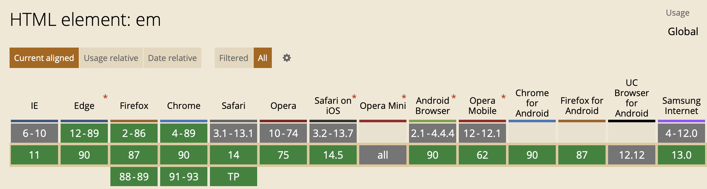 |
| :------------------------------------------------: |
|                     em 호환성                      |

#### rem

rem(relative to the root element)는 HTML 문서에서 최상위 요소 `<html>`에 선언된 폰트 크기를 기준으로 하는 단위입니다.

**호환성**

| 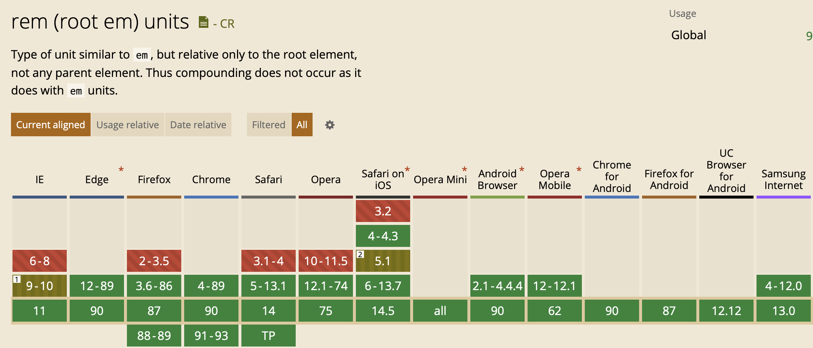 |
| :------------------------------------------------: |
|                     rem 호환성                     |

##### em과 rem 활용법

이 둘은 부모의 폰트값에 영향을 받기 때문에 제목에 크기에 따라 안에 들어있는 콘텐츠의 크기를 조정할 때 유용합니다.

### img 태그

기본 `` 요소에서는 브라우저에게 오직 하나의 소스 파일만 제시할 수 있습니다.

```html
<!-- 500px x 500px -->

```

| 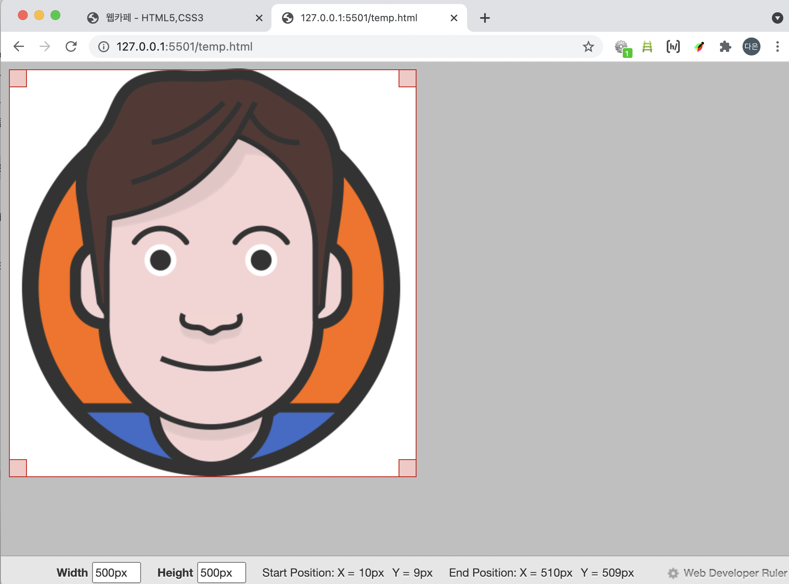 |
| :---------------------------------: |
|          이미지 태그 예제           |

그러나 `srcset`과 `sizes`라는 두 가지 속성을 사용해 브라우저가 뷰포트 너비에 따른 그림을 선택하도록 할 수 있습니다.

- srcset

  `srcset`은 브라우저에게 제시할 이미지 목록과 그 크기를 정의합니다. 각 쉼표 앞에 3가지를 적습니다.

  1. 이미지 파일명
  2. 공백
  3. 이미지 고유 픽셀 너비

  이 때 주의 할 점은 이미지의 크기로 `px`단위가 아닌 `w` 디스크립터 혹은 `x` 디스크립터를 입력해야 하며, 작은 크기 이미지부터 순서대로 입력해야 합니다.

  - W descriptor
    `w` 디스크립터(Width descriptor)는 이미지의 원본 크기(가로 너비)를 의미합니다. 예를 들어 `400x300`(px) 크기 이미지의 `w` 값은 `400w`입니다.

    > 브라우저(User agent)는 지정된 `w` 디스크립터를 통해 각 이미지의 최적화된 픽셀 밀도를 계산합니다.

    **srcset 예시**

    ```html
    
    ```

    | 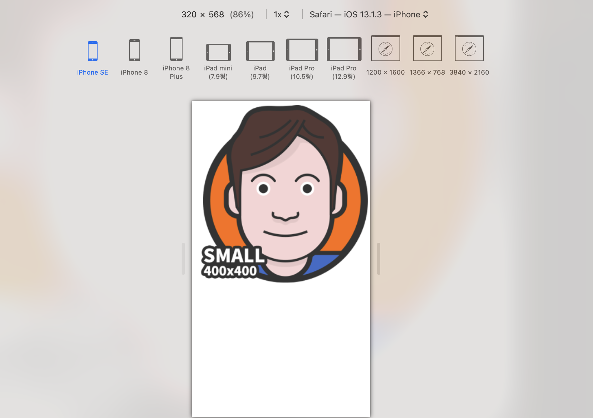 |
    | :------------------------------------------: |
    |   w 스크립터를 이용한 반응형 디자인(small)   |

    뷰 포트 너비가 400px 이하일 때 `heropy_small.png`(400px)가 사용된 것을 볼 수 있습니다.

    |  |
    | :-------------------------------------------: |
    |   w 스크립터를 이용한 반응형 디자인(medium)   |

    뷰 포트 너비가 401~700px 이하일 때 `heropy_medium.png`(700px)가 사용된 것을 볼 수 있습니다.

    | 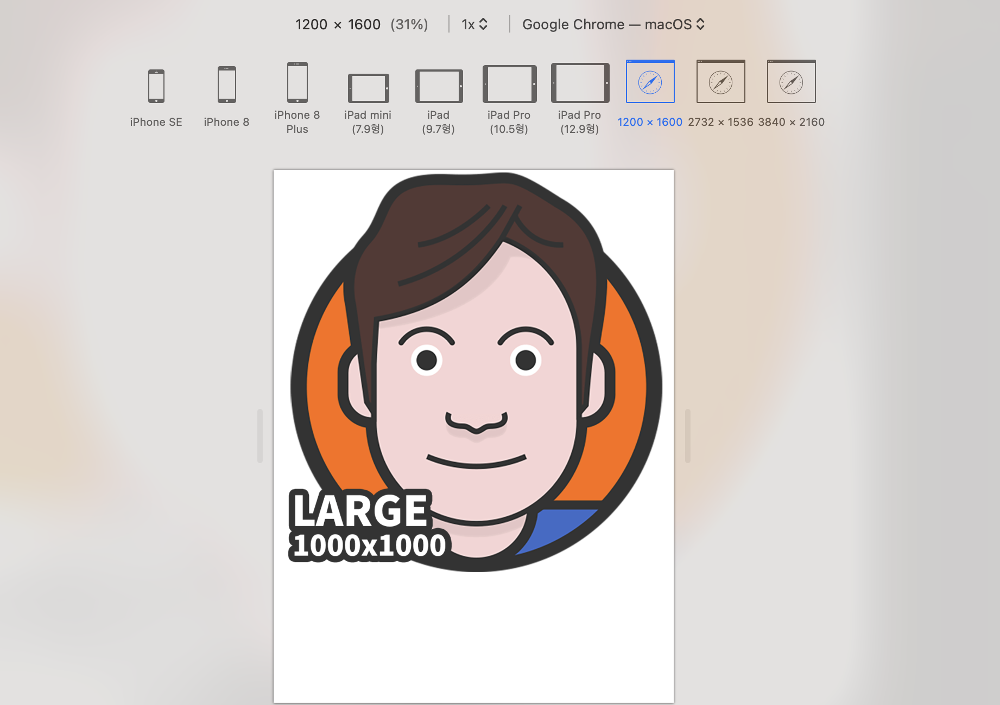 |
    | :------------------------------------------: |
    |   w 스크립터를 이용한 반응형 디자인(large)   |

    뷰 포트 너비가 401~700px 이하일 때 `heropy_large.png`(1000px)가 사용된 것을 볼 수 있습니다.

    고정된 이미지 크기를 유지하려면 `width` 속성을 추가할 수 있습니다.

    **srcset+width 예시**

    ```html
    
    ```

    | 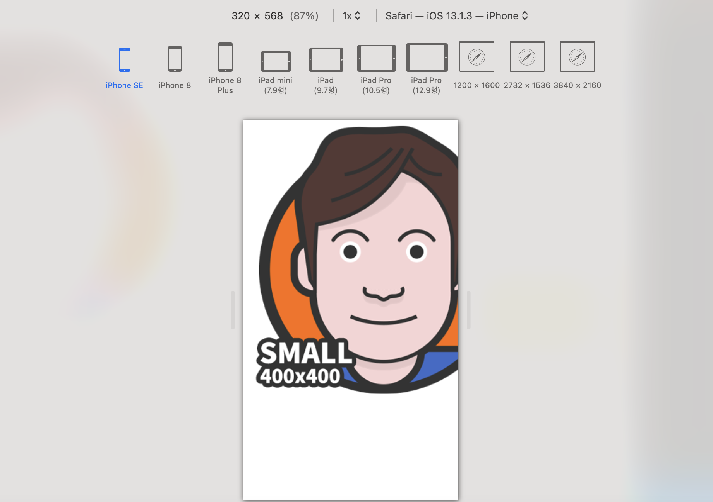 |
    | :----------------------------------------------: |
    |     w 스크립터를 이용한 반응형 디자인(small)     |

    | 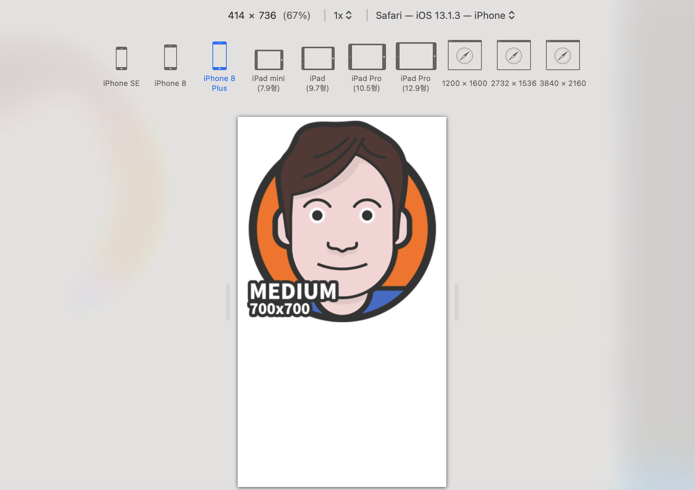 |
    | :-----------------------------------------------: |
    |     w 스크립터를 이용한 반응형 디자인(medium)     |

    | 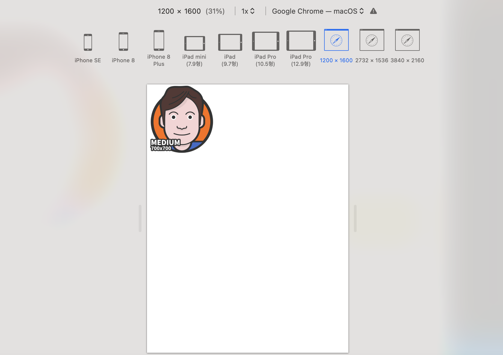 |
    | :----------------------------------------------: |
    |     w 스크립터를 이용한 반응형 디자인(large)     |

  - X descriptor
    x 디스크립터는 이미지의 비율 의도를 의미합니다. 위 `w` 디스크립터에서 사용했던 예제를 다음과 같이 수정할 수 있습니다.

    ```html
    
    ```

    `x` 디스크립터는 디바이스의 픽셀 비율(Device pixel ration)과 일치하는 값으로 최적화 선택됩니다. 일반적으로 정수(integer)값으로 제공하는 것이 좋습니다.

- sizes

  `sizes`는 미디어 조건과 그 조건에 해당하는 이미지의 '최적화 출력 크기'를 지정합니다.

  ```html
  
  ```

  `sizes` 속성에 `min-width:1000px`이 추가되었기 때문에 이제 1000px이상일 경우에는 `heropy_medium.png`가 나타납니다.

  | 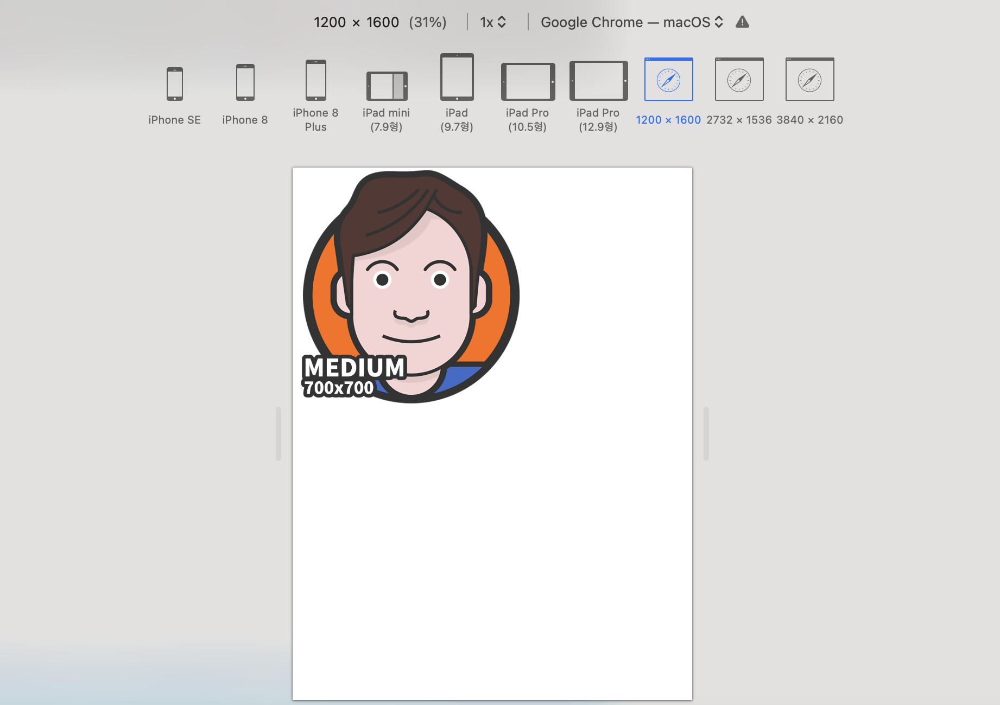 |
  | :--------------------------------------------: |
  |        sizes 속성에 min-width 추가 화면        |

  여기서 만약에 미디어 조건을 생략했을 경우 뷰포트 너비와 상관없이 `heropy_medium.png`만 사용되고 항상 `700px`의 크기를 가집니다.

결과적으로 `width`는 이미지의 '출력 크기'만을 지정하는데 반해, `sizes`는 이미지의 '출력 크기' + '최적 크기'도 함께 지정하는 개념입니다.

> 만약 `sizes`와 `width`를 같이 작성할 경우 `width`가 우선합니다.

**호환성**
|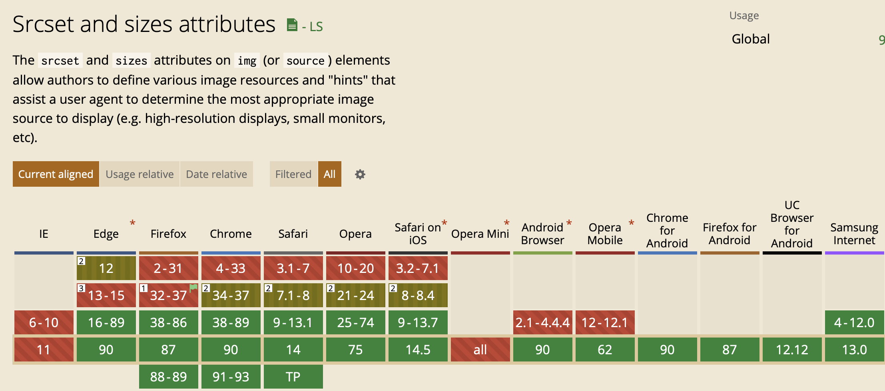|
|:--:|
|`srcset`과 `sizes`의 호환성|

### picture

`<picture>`태그는 ``요소의 다중 이미지 리소스를 위한 컨테이너를 정의할 때 사용합니다.

`<picture>`요소는 뷰포트의 너비에 따라 커지거나 작아지는 하나의 이미지를 사용하는 대신 서로 다른 디스플레이나 기기에서 해당 뷰포트에 알맞게 채워질 수 있도록 여러 개의 이미지 중에서 적절한 이미지를 사용하게 해줍니다.

`<picture>`요소는 0개 이상의 `<source>`요소와 하나의 ``요소로 구성되며, 브라우저는 `<source>`요소 중에서 해당 뷰포트와 가장 잘 적합한 `<source>`요소를 선택합니다.

브라우저는 `<source>`요소들의 속성값을 각각 확인해 나가며 조건을 만족하는 첫 번째 `<source>` 요소를 사용하고, 나머지 `<source>`요소들은 무시합니다. 이 때 ``요소는 `<picture>`요소의 자식 요소 중에서 가장 마지막에 위치해야 합니다. 이러한 ``요소는 `<picture>`요소를 지원하지 않는 브라우저를 위한 하위 호환성을 위해 사용되거나 명시된 `<source>`요소가 모두 조건을 만족하지 못 할 경우 사용합니다.

`<source>`요소에도 `srcset`속성이 있습니다. 미디어 조건은 `media`속성을 통해 줄 수 있습니다. `type`속성을 통해 이미지의 종류를 지정해 줄 수 있으며 사용자의 브라우저가 `type`에 적힌 이미지를 지원하지 않을 경우 해당 `<source>`는 건너뜁니다.

**예시**

```html
<picture>
  <source media="(min-width: 700px)" srcset="images/heropy_medium.png" />
  <source media="(min-width: 400px)" srcset="/images/heropy_small.png" />
  
</picture>
```

| 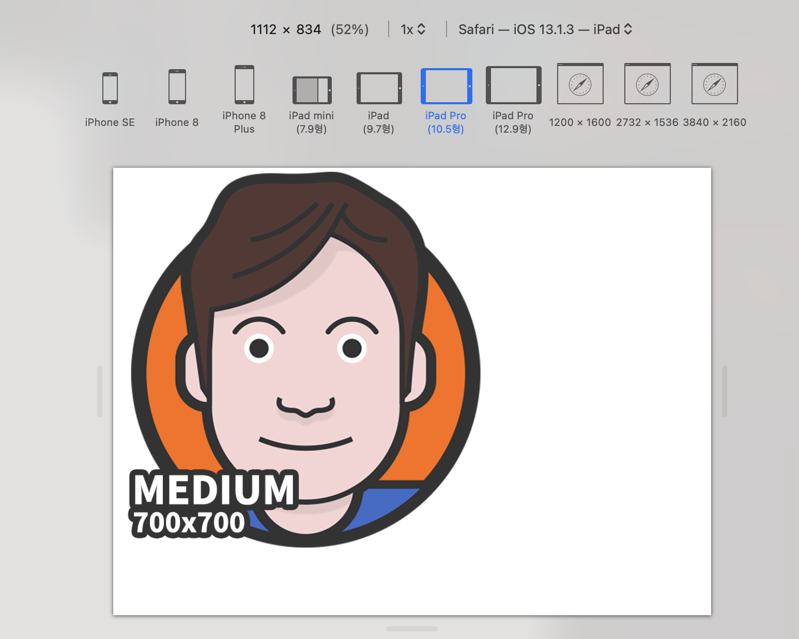 |
| :--------------------------------------: |
|      `pictures`의 첫 번째 `source`       |

뷰포트 너비가 700px이상이기 때문에 첫번째 `source`요소가 나옵니다.

| 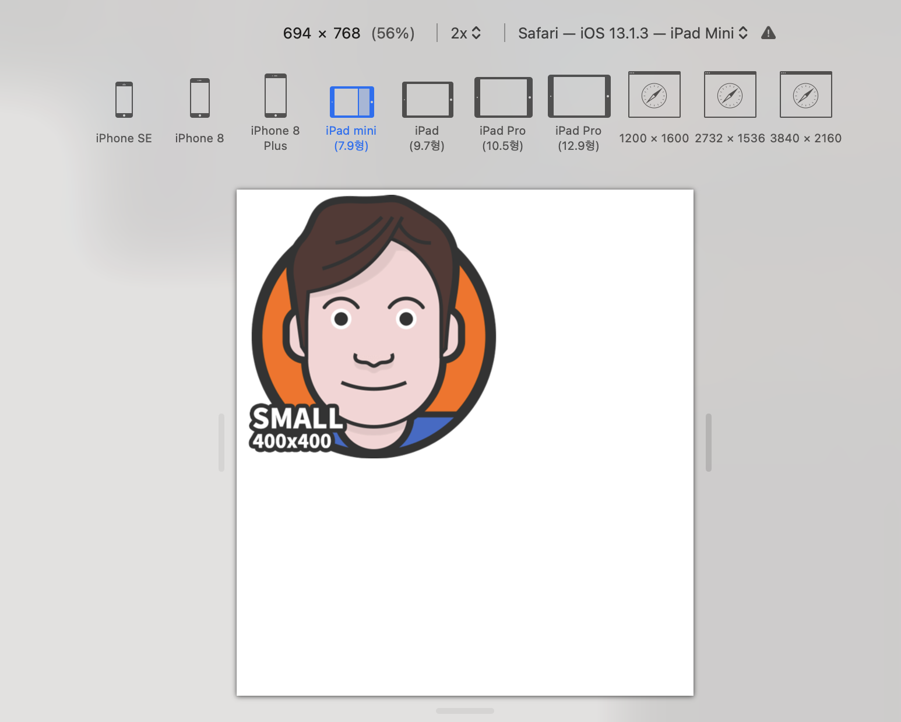 |
| :-------------------------------------: |
|      `pictures`의 두 번째 `source`      |

뷰포트의 너비가 400~699px 사이에 있기 때문에 두번째 `source`요소가 선택됩니다.

| 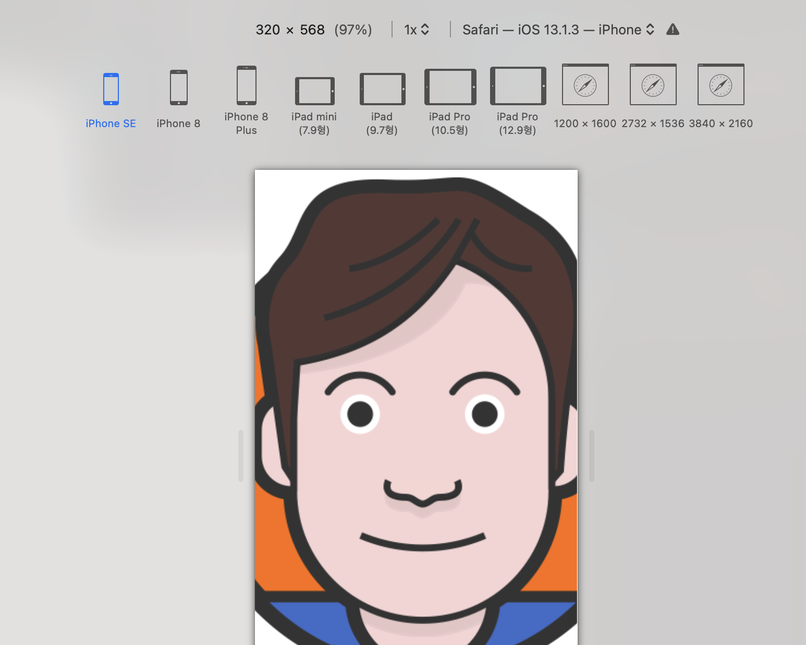 |
| :-------------------------------: |
|        `pictures`의 `img`         |

두 `source`의 조건에 모두 만족하지 못했기 때문에 `heropy.png`파일이 나옵니다.

**호환성**

| 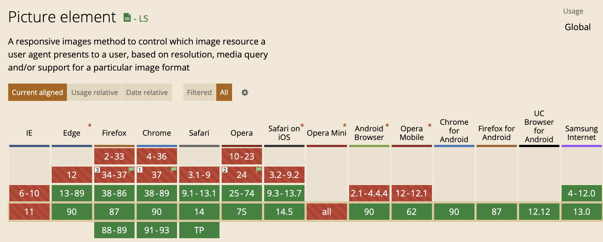 |
| :--------------------------------------------: |
|               `pictures` 호환성                |

### flexbox

flextbox는 행이나 열로 아이템을 배치하는 일차원 레이아웃 메소드입니다. 아이템들은 부족한 공간에 맞추기 위해 축소되거나 여분의 공간을 채우기 위해 변형될 수 있습니다.

**예제**

```html
<section class="content">
  <div class="flexbox">
    <div class="item">content1</div>
    <div class="item">content2</div>
    <div class="item">content3</div>
    <div class="item">content4</div>
  </div>
</section>
```

```css
.content {
  max-width: 800px;
  margin: 0 auto;
}
.flexbox {
  display: flex;
  flex-wrap: wrap;
  gap: 1em;
}
.item {
  min-height: 200px;
  flex-basis: 150px;
  flex-grow: 1;
  background-color: aqua;
  margin: 10px;
}
```

| 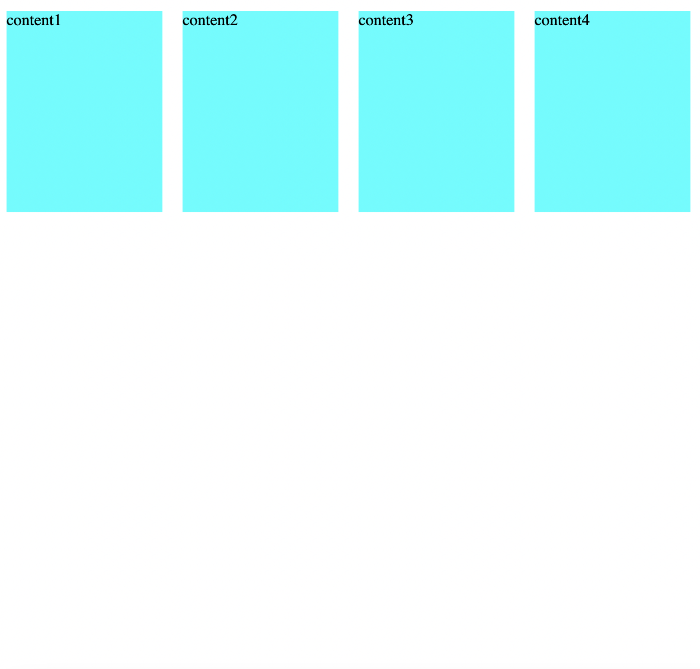 |
| :---------------------------------: |
|      플렉스를 이용한 레이아웃       |

|     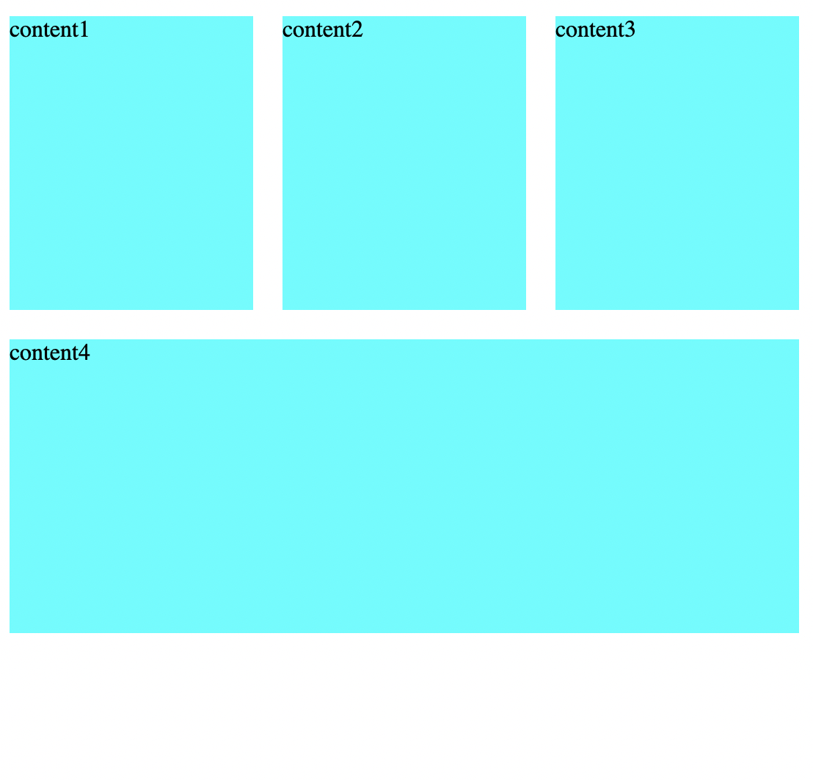     |
| :-----------------------------------------: |
| 뷰포트를 줄였을 때 나타나는 플렉스 레이아웃 |

뷰포트를 줄일 때 content4가 아래줄로 내려온 것을 볼 수 있습니다.

**호환성**
|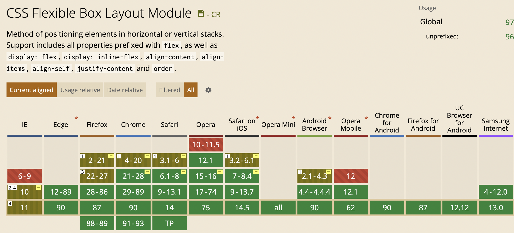|
|:--:|
|플렉스 호환성|

### grid

그리드 레이아웃은 페이지를 여러 주요 영역으로 나누거나, 크기와 위치 및 문서 계층 구조의 관점에서 편리합니다.

테이블과 마찬가지로 그리드 레이아웃은 세로 열과 가로 행을 기준으로 요소를 정렬할 수 있습니다. 하지만, 테이블과 달리 그리드는 다양한 레이아웃을 훨씬 더 쉽게 구현할 수 있습니다. 예를 들어, 그리드 컨테이너 속 자식 요소를, 마치 CSS로 일일이 위치를 지정해 준 것처럼, 실제로 겹치게 층을 지면서 자리를 잡도록 각 요소의 위치를 지정해 줄 수도 있습니다.

**예시**

```html
<ul class="”boxes”">
  <li>
    <div class="”boxes__text-wrapper”">
      <h2>Title</h2>
      <p>We worked hard.</p>
    </div>
  </li>
</ul>
```

위 코드에서 보이는 `li`태그를 6개로 만든 뒤 화면에 출력하면 다음과 같습니다.

| 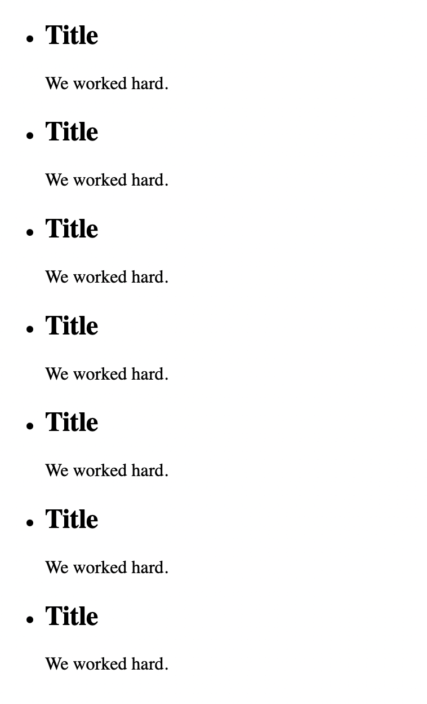 |
| :-------------------------------: |
|             목록 생성             |

여기서 브라우저가 40em 이상일 때 그리드 컨테이너가 한 부분으로 6개의 컬럼을 갖도록 설정하려고 하면, 다음과 같이 CSS를 작성할 수 있습니다.

```css
.boxes {
  display: grid;
  grid-auto-rows: minmax(125px, auto);
  grid-gap: 0.5rem;
}
@media screen and (min-width: 40em) {
  .boxes {
    grid-template-columns: repeat(6, 1fr);
    grid-gap: 2px;
  }
}
```

| 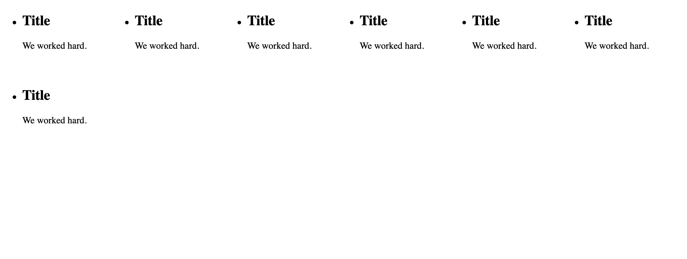 |
| :---------------------------------: |
|    `grid` 미디어 쿼리 적용 화면     |

**호환성**

| 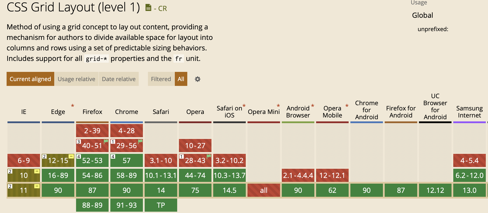 |
| :------------------------------------------: |
|                `grid` 호환성                 |

<details>
<summary>참고자료</summary>
<a href="https://developer.mozilla.org/">MDN</a>
<br />
<a href="https://caniuse.com/">Can I Use</a>
<br />
<a href="https://www.w3schools.com/">W3school</a>
<br />
<a href="https://apple.com/">Apple</a>
<a href="https://developer.mozilla.org/ko/docs/Learn/CSS/CSS_layout/Responsive_Design">MDN</a>
<br />
<a href="http://www.wa.or.kr/m3/sub3.asp">한국웹접근성인증평가원</a>
<br />
<a href="http://beesflow.co.kr/blog">비즈플로우</a>
<br />
<a href="https://www.slideshare.net/labsnc/04-28190062">반응형웹에서접근성확보방법(LAB Snc)</a>
<br />
<a href="https://heropy.blog/2019/06/16/html-img-srcset-and-sizes/">이미지 사용 출처</a>
<br>
<a href="https://developer.mozilla.org/ko/docs/Web/CSS/grid">MDN Grid</a>
<br>
<a href="https://developer.mozilla.org/ko/docs/Web/CSS/flex">MDN Flex</a>
<br>
<a href="https://developer.mozilla.org/ko/docs/Learn/HTML/Multimedia_and_embedding/Responsive_images">MDN 반응형 이미지</a>
<br>
<a href="https://developer.mozilla.org/en-US/docs/Web/HTML/Element/picture">MDN picture</a>
<br>
<a href="https://developer.mozilla.org/en-US/docs/Web/HTML/Element/picture">MDN Pictures</a>
<br>
<a href="https://developer.mozilla.org/en-US/docs/Web/HTML/Element/picture">MDN CSS 값과 단위</a>
<br>
<a href="https://caniuse.com">Can I Use</a>
<br>
</details>
